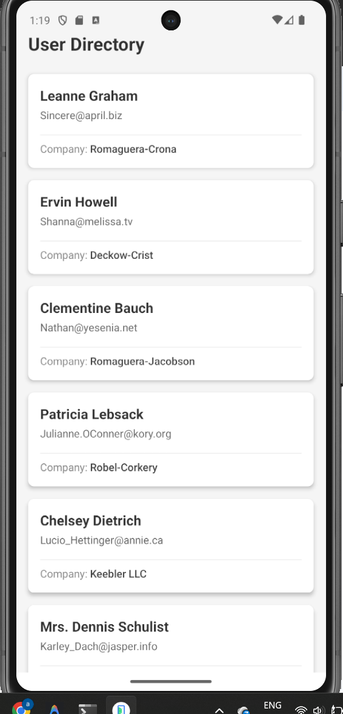
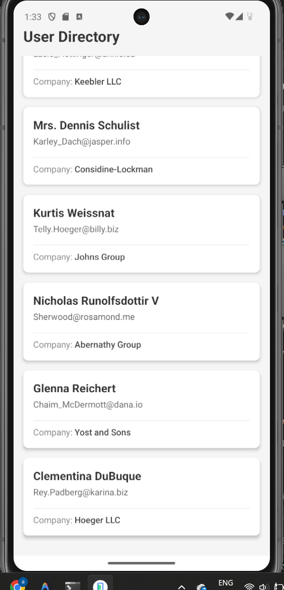
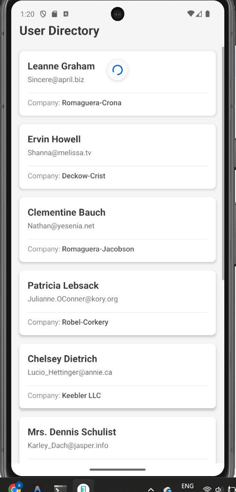

# User List API App

A simple React Native application built using Expo that fetches and displays user data from an API.  
This project demonstrates API integration, async handling, FlatList usage, reusable components, loading states, and error handling.

---

# Features

- Fetch user data from API
- Display user name
- Display email
- Display company name
- Loading indicator while fetching data
- Error handling
- FlatList implementation
- Pull-to-refresh functionality
- Reusable user card component
- Clean and responsive UI

---

# Technologies Used

- React Native
- Expo
- JavaScript
- React Hooks (`useState`, `useEffect`)

---

# Screenshots of the screens

1. User Listing



---


---

2. Pull To Refresh




# API Used

```plaintext
https://jsonplaceholder.typicode.com/users